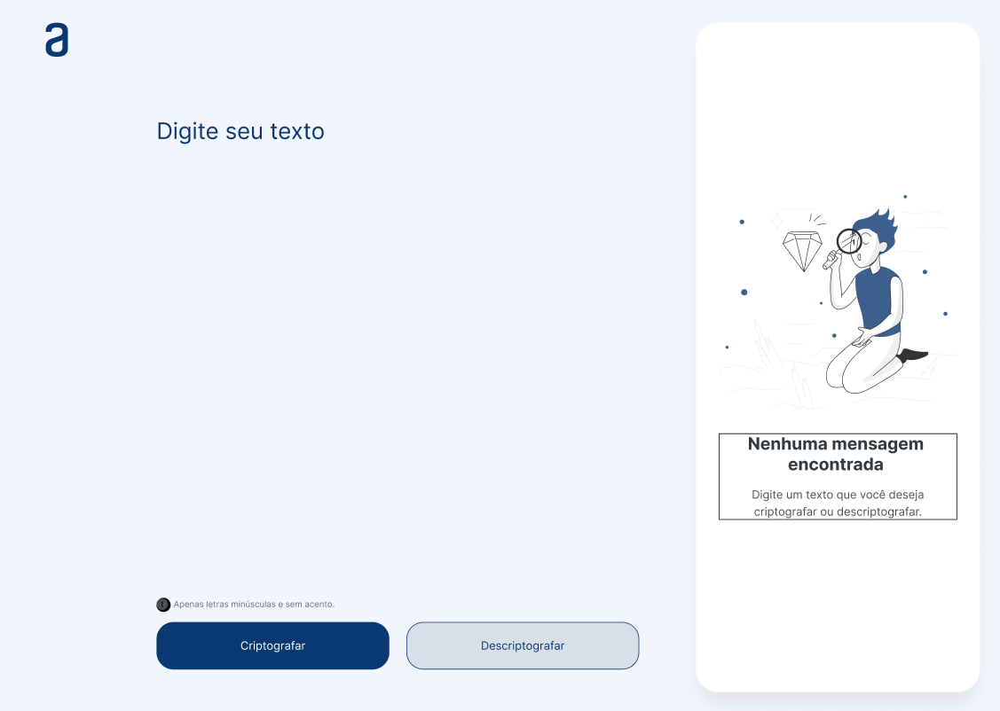

# Challenge Alura One

Esta é uma solução para o desafio do curso ONE - Oracle Next Education.

## Índice

### O desafio

A Aplicação deve criptografar textos, para troca de mensagens secretas com outras pessoas que saibam o segredo da criptografia utilizada.

As "chaves" de criptografia utilizadas são:
A letra "e" é convertida para "enter"
A letra "i" é convertida para "imes"
A letra "a" é convertida para "ai"
A letra "o" é convertida para "ober"
A letra "u" é convertida para "ufat"

Requisitos:
- Deve funcionar apenas com letras minúsculas
- Não devem ser utilizados letras com acentos nem caracteres especiais
- Deve ser possível converter uma palavra para a versão criptografada e também retornar uma palavra criptografada para a versão original.

Por exemplo:
"gato" => "gaitober"
gaitober" => "gato"

A página deve ter campos para inserção do texto a ser criptografado ou descriptografado, e a pessoa usuária deve poder escolher entre as duas opções
O resultado deve ser exibido na tela.

Extras:
- Um botão que copie o texto criptografado/descriptografado para a área de transferência - ou seja, que tenha a mesma funcionalidade do ctrl+C ou da opção "copiar" do menu dos aplicativos.

### Screenshot

### Links

- URL: [Host](https://decodificador-one-alura.vercel.app/)
- Repositório URL: [GitHub](https://github.com/ROBBIENOG/decodificadorOneAlura)

### Feito com

- HTML
- CSS
- JavaScript

#challengeonedecodificador5